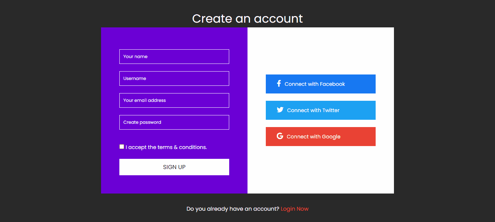
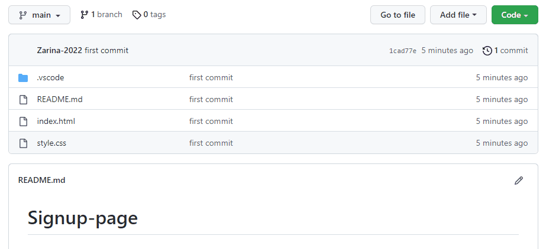

# Signup-page

Screen view:

<h2>This web site is about the university. </2>

<h3> I used CSS3 and HTML while preparing this project. </h3>

<h3>Here you can find all the information about the university:</h3>

 education levels, the location of the university,  

information over the environment of the university,  

comments and links. 

<h3> I learned new things in CSS and HTML with this project </h3>

<h3> I will continue to renew this project as I develop my CSS and HTML. </h3>

<h2> How to install and run the project. </h2>

Do share your valuable opinion, I appreciate your honest  

Enjoy Coding ❤
